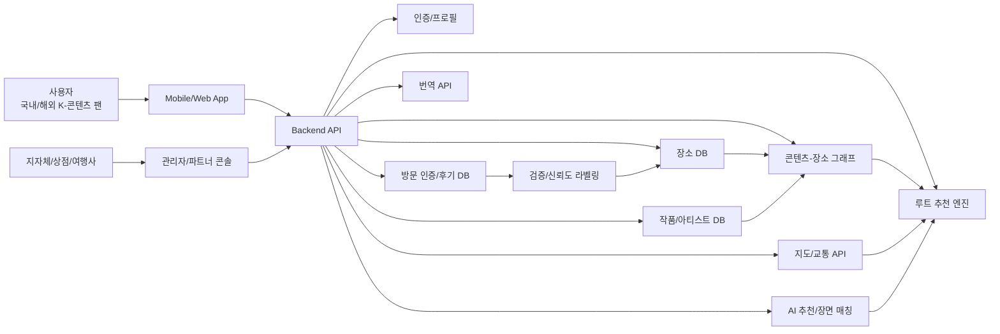

개인적으로 걸리는 점

- 우리의 데이터를 어떻게 모을지
- 성지순례 정보를 제공할 때, 그 작품의 장면을 제시하는 것에 저작권문제가 있는지
- 누가 돈을 내는 고객인지 확실한 파악이 필요
- 챗봇기능을 어떻게 넣을 수 있을지
- 개개인의 성지순례 이동기를 블로그마냥 작성할 수 있는 것도 좋을 듯
- 만약 데이터를 수작업으로 다 구축한다고 해도, 그걸 다른 서비스가 그대로 베껴갈 수 있는데 그것에 대한 고찰

- DUPIC: 어플O, 성지순례 원정대 모집, 사진을 통한 위치찾기, 핀을통한 성지순례위치 파악가능, 작품이라기보다는 남자아이돌이 방문한 위치가 성지위치
- K-Spotter: 어플X, 스트리트뷰 제공, 주변맛집제공, 한국드라마 뮤비 등 제공, 구글맵기반, 카카오맵/네이버/구글 지도로 연결하여 경로찾기 가능
- k-spot tour: 플레이스토어에 어플로 있음, 데이터가 매우매우부족 약 4개 작품 대상
- seichi: 일본 애니메이션 성지순례어플, 지도에 핀이있고 구글/apple 지도로 연결하여 경로찾기 가능, 작품수가 적음, 일회성플랜 39000원
- Kmaps: 케이팝 MV & 사진 지도: 어플O, 해외에도 spot 있음, 하지만 뮤직비디오/아이돌 중심
- K pop Drama spots: 자료는 엄청많음!! 하지만 4400원의 장벽, 커뮤니티 기능 부제, 어플O

# K-POP, K-드라마, K-영화 성지순례 정보 제공 서비스 기획 초안

> 작성 기준일: 2026-06-11  
> 기획 방향: 기존 성지순례 앱/웹 서비스가 이미 존재한다는 전제를 인정하고, 단순 장소 목록이 아니라 `작품 기반 장소 그래프 + 현장 추천 + 여행 동선 + 검증형 데이터`로 차별화한다.

---

## 프로젝트명

**(K-Loca) 내 주변의 K-콘텐츠 성지를 발견하고 여행 루트로 연결하는 팬덤 여행 플랫폼**

## 한 줄 소개

K-POP, K-드라마, K-영화 속 장소를 작품/아티스트/장면/지역 기준으로 통합하고, 사용자의 현재 위치와 취향에 맞춰 방문 가능한 성지순례 코스를 추천하는 AI 기반 K-콘텐츠 여행 서비스.

## 프로젝트 핵심 가설

K-콘텐츠 팬은 단순히 “촬영지가 어디인지”만 알고 싶은 것이 아니라, 실제 여행 중 다음 질문을 함께 해결하고 싶어 한다.

- 내가 좋아하는 작품/아티스트와 관련된 장소가 지금 주변에 있는가?
- 이 장소가 정확히 어떤 장면, 어떤 회차, 어떤 뮤직비디오와 연결되는가?
- 지금 영업 중인지, 사진을 찍어도 되는지, 팬 방문이 민폐가 되지 않는지 알 수 있는가?
- 여러 장소를 하루 동선으로 묶을 수 있는가?
- 주변 카페, 굿즈샵, 팝업, 전시, 공연장, 포토스팟까지 함께 추천받을 수 있는가?

따라서 K-Loca의 경쟁력은 장소 데이터의 양만이 아니라, **팬의 실제 이동 경험을 끝까지 설계하는 것**에 있다.

---

## 기획배경 및 문제인식

### 1. K-콘텐츠 관광 수요는 커졌지만 정보는 흩어져 있다

K-POP, K-드라마, K-영화는 한국 방문 동기를 만드는 핵심 콘텐츠가 되었다. 한국관광공사는 2023~2024년을 `Visit Korea Year`로 추진했고, 2019년 외래관광객 1,750만 명을 돌파한 이력을 공식적으로 제시하고 있다. 2024년에는 외래객 회복세가 커지며 한류 관광이 다시 중요한 성장축이 되었다.

하지만 팬이 실제로 여행을 준비할 때 정보는 여러 곳에 흩어져 있다.

- 블로그/유튜브/틱톡/트위터/X/인스타그램의 개인 후기
- Visit Korea, 지자체 관광 페이지, 드라마 제작사 홍보자료
- 팬 커뮤니티의 비공식 지도
- 네이버 지도/카카오맵/구글맵의 장소 정보
- 여행사 패키지 상품
- 일부 성지순례 앱의 제한적 장소 목록

이 정보들은 최신성, 정확도, 언어, 접근성, 동선 측면에서 일관되지 않다. 특히 해외 팬은 한국어 지명, 교통, 영업시간, 현장 예절, 예약 필요 여부를 한 번에 이해하기 어렵다.

### 2. 기존 서비스는 “장소 찾기”에 머무르는 경우가 많다

사용자가 언급한 DUCPIC, K-Spotter, KDora, K Pop Drama Spots 같은 유사 서비스는 팬덤 성지 정보를 모으려는 시도가 이미 있다는 점에서 시장성이 검증된 신호다. 다만 이 계열 서비스들은 일반적으로 다음 한계를 가진다.

- 장소 목록 또는 지도 핀 중심이라 실제 여행 동선 설계가 약함
- 특정 작품/드라마에 치우쳐 K-POP, 영화, 예능, 애니메이션까지 확장성이 부족함
- 장소와 장면의 연결 근거가 약하거나 사용자 검증 체계가 부족함
- “현재 내 주변에서 갈 만한 곳”을 추천하는 실시간 맥락 기능이 약함
- 영업 여부, 촬영 가능 여부, 혼잡도, 폐업/이전 정보 등 현장 정보 반영이 늦음
- 팬덤 경험은 있지만 지역 상권, 교통, 안전, 매너 정보를 함께 제공하지 못함

즉, 시장에는 이미 서비스가 있지만 **팬이 실제로 한국을 여행하는 순간의 문제**를 충분히 해결하지 못한다.

### 3. 한류 관광은 “콘텐츠 감상”에서 “현장 체험”으로 이동하고 있다

K-드라마 촬영지, K-POP 뮤직비디오 장소, 아이돌 생일 카페, 팝업스토어, 콘서트장, 굿즈샵, 전시, 포토부스는 각각 따로 소비되는 것이 아니라 하나의 팬덤 여행 코스로 묶인다. 예를 들어 해외 팬은 서울에 도착해 다음과 같은 흐름으로 움직인다.

1. 좋아하는 드라마 촬영지를 방문한다.
2. 주변 카페/식당에서 작품 속 장면과 유사한 사진을 찍는다.
3. 같은 지역의 아이돌 생일 카페나 굿즈샵을 찾는다.
4. 저녁에는 공연장 또는 팝업스토어로 이동한다.
5. 방문 인증을 SNS에 올리고 다른 팬과 공유한다.

그러나 현재 서비스들은 이 흐름을 한 번에 묶어주기보다, 장소 하나를 검색하거나 지도에 저장하는 수준에 머무르는 경우가 많다.

### 4. 지역 입장에서도 팬덤 관광을 더 정교하게 연결할 필요가 있다

포항의 `갯마을 차차차`, 남이섬의 `겨울연가`, 서울의 여러 K-POP/드라마 촬영지는 지역 방문을 유도한 대표 사례다. 문제는 인기 작품이 바뀔 때마다 관심이 특정 장소에 몰리고, 이후에는 정보 관리가 흐려진다는 점이다.

지역 소상공인과 지자체 입장에서는 다음 니즈가 있다.

- 팬 방문을 지역 소비로 연결하고 싶다.
- 폐업/이전/공사 중인 장소 정보가 잘못 퍼지는 것을 줄이고 싶다.
- 특정 장소 과밀을 줄이고 주변 대체 장소로 분산시키고 싶다.
- 외국인 방문객에게 다국어 안내와 기본 매너를 제공하고 싶다.
- 콘텐츠 인기에 따른 방문 데이터를 보고 싶다.

K-Loca는 팬에게는 여행 도구, 지역에는 한류 관광 운영 도구가 될 수 있다.

---

## 기획의도

K-Loca는 “K-콘텐츠 성지순례 장소 모음”이 아니라 **팬덤 기반 여행 운영체제**를 목표로 한다.

핵심 기획 의도는 세 가지다.

### 1. 장소 DB를 작품/장면/아티스트 단위로 구조화한다

단순히 “이곳은 촬영지”라고 저장하지 않고 다음과 같이 연결한다.

- 작품명, 회차, 장면 설명
- 출연 배우/아티스트
- OST, 뮤직비디오, 예능 클립
- 실제 장소명, 주소, 좌표
- 장면 캡처 위치, 추천 촬영 각도
- 방문 가능 여부, 영업시간, 예약 여부
- 공식/비공식 출처
- 사용자 검증 상태

이렇게 구조화하면 “작품에서 장소로”, “장소에서 주변 작품으로”, “아티스트에서 관련 성지로” 탐색할 수 있다.

### 2. 현재 위치 기반으로 근처 K-콘텐츠를 추천한다

여행자는 항상 사전에 계획한 장소만 가지 않는다. 이미 홍대, 성수, 연남, 강남, 북촌, 제주, 부산, 포항 등에 있을 때 “근처에 내가 좋아할 만한 K-콘텐츠 장소가 있나?”를 알고 싶다.

K-Loca는 사용자의 현재 위치, 선호 장르, 좋아하는 아티스트/배우/작품, 남은 시간, 이동수단을 기준으로 근처 성지를 추천한다.

### 3. 팬 경험과 현실 여행 정보를 함께 제공한다

팬덤 앱은 감성만으로는 부족하고, 여행 앱은 팬덤 맥락이 부족하다. K-Loca는 두 층을 결합한다.

- 팬덤 맥락: 작품 장면, 대사, MV 타임스탬프, 포토존, 방문 인증
- 여행 맥락: 이동시간, 영업시간, 예약, 혼잡, 언어, 예절, 주변 상권

---

## 주요기능

### 1. K-콘텐츠 성지 통합 검색

작품, 아티스트, 배우, 지역, 장면 키워드로 성지를 검색한다.

- K-드라마 촬영지
- K-영화 촬영지
- K-POP 뮤직비디오/자켓/예능 촬영지
- 아이돌 생일 카페/팝업스토어/굿즈샵
- OST/공연/팬미팅 관련 장소
- 향후 애니메이션, 웹툰, 게임 배경지까지 확장

### 2. 작품-장소 연결 카드

각 장소에는 단순 주소가 아니라 콘텐츠 맥락을 제공한다.

- 어떤 작품의 어떤 장면인지
- 몇 화/몇 분/뮤직비디오 몇 초에 나오는지
- 방문자가 같은 구도로 사진을 찍을 수 있는 위치
- 공식 출처 또는 팬 검증 출처
- 방문 시 주의할 점

### 3. 현재 위치 기반 근처 성지 추천

사용자가 특정 지역에 도착하면 반경 내 관련 장소를 추천한다.

예시:

- “성수동에 도착했습니다. 800m 안에 최근 K-POP 팝업 2곳, 드라마 촬영지 3곳, 팬들이 많이 저장한 카페 4곳이 있습니다.”
- “지금 위치에서 20분 안에 갈 수 있는 `선재 업고 튀어` 관련 장소가 있습니다.”
- “현재 영업 중이고 사진 촬영 후기가 좋은 곳만 보기”

### 4. AI 여행 루트 생성

사용자의 일정, 숙소 위치, 선호 작품, 이동수단을 입력하면 반나절/하루/2박 3일 코스를 생성한다.

- 도보 중심 루트
- 대중교통 중심 루트
- 포토스팟 중심 루트
- 카페/굿즈샵 포함 루트
- 비 오는 날 대체 루트
- 혼잡 회피 루트

### 5. 성지 인증 및 팬 커뮤니티

방문자는 현장에서 체크인하고 사진/후기를 남긴다.

- GPS 기반 방문 인증
- 장면 따라 찍기 챌린지
- 팬 후기 번역
- 장소 정보 수정 제보
- 폐업/이전/촬영 제한 신고
- 국가/언어별 추천 후기 표시

### 6. 검증형 장소 데이터 관리

기존 서비스의 약점인 정보 신뢰도를 개선한다.

- 공식 출처 확인: 지자체, 관광공사, 제작사, 장소 공식 계정
- 사용자 검증: 다수 방문 인증, 최근 사진, 최근 후기
- 운영 상태 업데이트: 영업시간, 폐업, 공사, 예약 필요 여부
- 신뢰도 라벨: 공식 확인, 사용자 다수 검증, 제보 필요

### 7. 다국어/현지화 지원

주 사용자를 해외 한류 팬까지 확장한다.

- 한국어, 영어, 일본어, 중국어 우선 지원
- 장소명 로마자/현지 표기 병기
- 대중교통 안내를 외국인 친화적으로 변환
- 촬영 예절, 사유지 방문 주의, 매장 이용 매너 안내
- 자동 번역 후기

### 8. 지역 상권 연계

성지 방문을 주변 소비로 연결한다.

- 근처 카페/식당/소품샵 추천
- 팬덤 이벤트/팝업스토어 등록
- 지역 관광 쿠폰
- 지자체 추천 코스
- 소상공인용 장소 관리 페이지

### 9. 개인화 추천

사용자의 저장/방문/좋아요 데이터를 기반으로 추천한다.

- 좋아하는 아티스트와 같은 소속사/촬영지를 추천
- 같은 작품의 다른 촬영지를 추천
- 비슷한 감성의 드라마/영화 장소 추천
- 여행 중 동선에 맞는 다음 장소 추천

### 10. AI 장면 매칭 보조

사용자가 작품 장면 캡처나 링크를 입력하면 AI가 후보 장소를 찾는 기능을 제공한다.

- 이미지 기반 장소 후보 탐색
- 장면 설명 기반 장소 검색
- 팬 제보를 검증 큐에 등록
- 관리자 검수 후 DB 반영

---

## 시장분석

### 시장 규모 및 흐름

한류는 관광 수요와 직접 연결되는 문화 자산이다. 한국관광공사는 관광 홍보, 관광자원 개발, 관광산업 R&D를 주요 역할로 두고 있으며, 2023~2024년 `Visit Korea Year`를 추진했다. 한국 관광은 2019년 외래관광객 1,750만 명 돌파 이후 팬데믹으로 급감했으나, 2024년에는 약 1,637만 명 수준까지 회복된 것으로 집계된다.

K-콘텐츠 산업 자체도 관광의 강한 유입 요인이다. KOCOWA 같은 K-콘텐츠 스트리밍 서비스는 미주, 유럽, 오세아니아 등으로 확장하며 K-드라마와 K-POP 소비 접점을 넓히고 있다. 콘텐츠 소비 지역이 넓어질수록 “한국에 가서 실제 장소를 경험하고 싶다”는 여행 수요가 자연스럽게 커진다.

최근 한류 관광의 특징은 다음과 같다.

- 드라마/영화 촬영지 방문이 단발성 관광에서 팬덤 인증 문화로 변화
- K-POP 콘서트, 팬미팅, 팝업스토어, 생일 카페와 관광이 결합
- SNS 숏폼을 통한 장소 확산 속도가 빨라짐
- 해외 팬이 직접 한국 여행 루트를 설계하는 수요 증가
- 지역 지자체가 한류 IP를 관광 자산으로 활용하려는 움직임 확대
- 애니메이션, 웹툰, 게임 등 비실사 콘텐츠까지 성지순례 대상 확장 가능

### 기존 서비스 및 대체재 분석

| 구분 | 서비스/대체재 | 강점 | 한계 | K-Loca의 개선점 |
| --- | --- | --- | --- | --- |
| 성지순례 앱 | DUCPIC, K-Spotter, KDora, K Pop Drama Spots 등 | 이미 성지순례 니즈를 겨냥. 지도 기반 탐색 가능 | 데이터 범위와 최신성, 검증 체계, 여행 동선 기능이 제한적일 가능성 | 작품-장소-장면 그래프, 검증 라벨, 루트 생성, 현장 추천으로 확장 |
| 일반 지도 | Google Maps, Naver Map, Kakao Map | 정확한 지도/교통/리뷰/영업 정보 | K-콘텐츠 맥락이 약함. 어떤 장면과 연결되는지 알기 어려움 | 일반 지도 위에 콘텐츠 맥락 레이어를 얹음 |
| 관광 공식 사이트 | Visit Korea, 지자체 관광 페이지 | 공식성, 다국어, 신뢰도 | 팬덤 관점의 세부 장면/인증/커뮤니티 경험이 약함 | 공식 데이터와 팬 제보를 함께 구조화 |
| 블로그/유튜브/틱톡 | 개인 후기, 감성 콘텐츠, 최신 트렌드 | 생생하고 빠름 | 정보가 흩어져 있고 검증이 어려움. 지도/루트로 바로 쓰기 불편 | 팬 후기에서 장소 후보를 모으고 검증형 DB로 전환 |
| 여행사 패키지 | 가이드, 이동 편의성 | 개인 취향 반영이 낮고 일정이 고정됨 | AI가 취향/시간/위치에 맞춰 동적 루트 생성 |
| 팬 커뮤니티 | 팬덤 정보 밀도, 빠른 제보 | 신규 유입자와 외국인에게 진입장벽 높음 | 다국어, 위치 기반, 초심자 친화 UX 제공 |

### 경쟁 서비스 대비 더 좋아질 점

#### 1. 단순 지도 핀에서 “여행 가능한 코스”로 개선

기존 서비스가 장소를 보여주는 데 그친다면, K-Loca는 실제 이동 가능한 루트로 묶는다. 사용자는 “오늘 4시간 동안 홍대 주변에서 갈 수 있는 세븐틴/뉴진스/K-드라마 관련 장소”처럼 현실적인 요청을 할 수 있다.

#### 2. 콘텐츠 맥락을 더 깊게 제공

장소명과 주소만으로는 팬 경험이 약하다. K-Loca는 회차, 장면, 대사, MV 타임스탬프, 포토 구도, 관련 OST까지 연결해 팬이 “왜 이 장소가 의미 있는지”를 알 수 있게 한다.

#### 3. 정보 신뢰도를 등급화

팬덤 지도는 정보가 빠르지만 틀릴 수 있고, 공식 사이트는 정확하지만 느릴 수 있다. K-Loca는 `공식 확인`, `최근 방문 검증`, `제보 필요`, `폐업/이전 의심` 같은 라벨을 붙여 사용자가 정보 신뢰도를 판단하게 한다.

#### 4. 주변 추천으로 우연한 발견을 만든다

기존 서비스는 목적지를 검색해야 쓰임이 생긴다. K-Loca는 사용자가 특정 지역에 들어왔을 때, 주변의 K-콘텐츠 장소를 먼저 발견하게 한다. 이는 여행 중 체류 시간과 방문 장소 수를 늘리는 데 유리하다.

#### 5. 팬덤과 지역 상권을 연결

성지순례는 사진만 찍고 끝나는 경우가 많다. K-Loca는 주변 카페, 굿즈샵, 지역 쿠폰, 팝업 이벤트를 함께 연결해 지역 소비를 만든다. 이는 지자체/소상공인 협업 가능성을 높인다.

#### 6. 애니메이션/웹툰/게임까지 확장 가능

초기에는 K-POP, K-드라마, K-영화로 시작하되, 장소 기반 콘텐츠라면 애니메이션, 웹툰, 게임 배경지까지 확장할 수 있다. 특히 최근 글로벌 K-콘텐츠는 실사와 비실사의 경계가 흐려지고 있어, 장기적으로 IP 기반 여행 플랫폼으로 확장 가능하다.

### 타깃 사용자

#### 1차 타깃

- 한국을 방문하는 해외 K-POP/K-드라마 팬
- 서울/부산/제주/포항 등에서 성지순례를 하고 싶은 국내 팬
- 콘서트/팬미팅 일정에 맞춰 여행을 계획하는 팬

#### 2차 타깃

- 지자체 관광 담당자
- 촬영지 주변 카페/식당/소품샵/굿즈샵
- 한류 투어를 운영하는 여행사
- 콘텐츠 제작사/OTT 홍보팀

### 수익모델

초기 MVP는 사용자 확보를 위해 무료 중심으로 운영한다. 이후 다음 모델을 검토한다.

- 프리미엄 구독: AI 루트 생성, 오프라인 저장, 고급 필터, 여행 플래너
- B2B 광고/입점: 팬덤 카페, 굿즈샵, 팝업스토어 노출
- 지자체 제휴: 지역 한류 관광 지도/스탬프 투어 제작
- 여행사 제휴: 테마 투어 예약 연결
- 커머스 연계: 굿즈, 티켓, 교통패스, 쿠폰
- 데이터 리포트: 지역별 팬 방문 트렌드 분석

### 시장 진입 전략

대형 관광 플랫폼이나 지도 서비스와 정면 경쟁하지 않는다. 진입은 좁고 선명한 팬덤 사용 장면에서 시작한다.

1. **서울 중심 MVP**  
   홍대, 성수, 연남, 강남, 북촌, 여의도, 상암 등 K-콘텐츠 밀도가 높은 지역부터 구축한다.

2. **작품/아티스트별 인기 코스 확보**  
   최신 인기 드라마, 글로벌 팬덤이 강한 K-POP 아티스트, 넷플릭스/디즈니+ 화제작 중심으로 시작한다.

3. **사용자 제보 기반 DB 확장**  
   팬들이 직접 장소를 제보하고, 인증/검증에 참여하게 한다.

4. **지자체/소상공인 협업**  
   지역 관광과 연결 가능한 코스부터 제휴를 시도한다.

5. **외국인 사용성 강화**  
   다국어, 대중교통, 예절 안내를 초기에 넣어 해외 팬의 불편을 줄인다.

---

## 시스템구성도

### 주요 데이터 구조

#### 장소 데이터

- 장소명
- 주소/좌표
- 영업시간
- 방문 가능 여부
- 촬영 가능 여부
- 사유지/공공장소 여부
- 접근성
- 주변 상권 태그
- 최신 검증 일자

#### 콘텐츠 데이터

- 작품/아티스트명
- 카테고리: K-POP, 드라마, 영화, 예능, 애니메이션
- 회차/장면/타임스탬프
- 출연진/아티스트
- 공식 링크
- 관련 이미지/설명

#### 연결 데이터

- 콘텐츠 ID
- 장소 ID
- 연결 근거
- 출처 URL
- 신뢰도 등급
- 추천 포토존
- 방문 유의사항

### 기술 스택 예시

| 구분 | 기술 |
| --- | --- |
| Frontend | React Native 또는 Flutter, Web은 Next.js |
| Backend | NestJS 또는 FastAPI |
| Database | PostgreSQL + PostGIS |
| Search | Elasticsearch 또는 OpenSearch |
| Map | Google Maps API, Naver Maps API, Kakao Maps API 중 타깃 시장에 맞춰 선택 |
| AI | LLM API, 이미지 임베딩, 장소 후보 검색 |
| Translation | DeepL, Google Translate API, 자체 용어집 |
| Infra | AWS, GCP, Vercel, Cloudflare |

### AI 활용 전략

- 사용자 취향 기반 장소 추천
- 일정/위치/이동수단 기반 루트 생성
- 장면 캡처 또는 설명 기반 장소 후보 탐색
- 사용자 후기 자동 요약 및 번역
- 장소 제보의 중복/오류 탐지
- 외국인용 쉬운 길안내 및 방문 매너 안내 생성

---

## 예상 리스크 및 대응

| 리스크 | 내용 | 대응 |
| --- | --- | --- |
| 저작권/초상권 | 작품 장면 이미지, 배우/아이돌 이미지 사용 제한 | 직접 캡처 저장 최소화, 공식 링크/텍스트 설명 중심, 권리자 제휴 검토 |
| 장소 민폐 방문 | 사유지, 주거지, 영업장 과밀 방문 문제 | 방문 매너 안내, 촬영 제한 표시, 민감 장소 비노출/흐림 처리 |
| 데이터 정확도 | 폐업/이전/공사 정보 반영 지연 | 사용자 제보, 최근 방문 인증, 신뢰도 라벨 |
| 경쟁 서비스 | 기존 성지순례 앱, 지도 서비스, 관광 사이트 존재 | 팬덤 맥락 + 루트 + 검증 + 주변 추천으로 차별화 |
| 초기 데이터 부족 | 장소 DB 구축 비용 큼 | 서울 핵심 지역과 인기 작품부터 시작, 크롤링보다 제보/공식 데이터 연동 중심 |
| 다국어 품질 | 장소명/고유명사 번역 오류 | 자체 용어집, 사용자 수정 제안, 원문 병기 |

---

## MVP 범위

초기 3개월 MVP는 아래 기능에 집중한다.

1. 서울 주요 지역 200~300개 성지 데이터 구축
2. 작품/아티스트/지역 기반 검색
3. 지도 기반 장소 탐색
4. 현재 위치 주변 추천
5. 반나절/하루 루트 생성
6. 사용자 방문 인증 및 장소 제보
7. 한국어/영어 지원
8. 관리자 검수 페이지

성공 지표:

- 장소 저장 수
- 루트 생성 수
- 방문 인증 수
- 제보 데이터의 검증 전환율
- 사용자 1명당 세션 내 탐색 장소 수
- 외국인 사용자의 길찾기 클릭률

---

## 참고자료 및 시장조사 출처

- Korea Tourism Organization, [History](https://knto.or.kr/eng/History)  
  한국관광공사는 관광 홍보, 관광자원 개발, 관광산업 R&D를 주요 역할로 두고 있으며, 2023~2024년 Visit Korea Year와 2019년 외래관광객 1,750만 명 돌파 이력을 제시한다.

- Ministry of Culture, Sports and Tourism, [Statistics](https://www.mcst.go.kr/english/statistics/statistics.jsp)  
  문화체육관광부 통계 페이지는 문화·콘텐츠·관광 분야 통계 접근점을 제공한다.

- Wikipedia, [Tourism in South Korea](https://en.wikipedia.org/wiki/Tourism_in_South_Korea)  
  2024년 한국 외래관광객 약 1,637만 명과 한류가 관광 수요에 미치는 영향을 요약한다.

- Wikipedia, [Korean Wave](https://en.wikipedia.org/wiki/Korean_Wave)  
  한류가 드라마, K-POP, 관광, 음식, 뷰티 등으로 확장되며 한국 방문 동기에 영향을 미친 흐름을 정리한다.

- Wikipedia, [Kocowa](https://en.wikipedia.org/wiki/Kocowa)  
  K-콘텐츠 스트리밍 서비스가 미주, 유럽, 오세아니아로 확장되며 해외 K-콘텐츠 접점이 넓어지고 있음을 확인할 수 있다.

- Conde Nast Traveler, [A First-Time Visit to Seoul With K-Dramas as My Guide](https://www.cntraveler.com/story/k-drama-guide-to-seoul)  
  K-드라마 촬영지가 실제 서울 여행 경험을 이끄는 사례를 보여준다.

- Marie Claire, [Where Is Single's Inferno Filmed?](https://www.marieclaire.com/culture/tv-shows/where-is-singles-inferno-filmed/)  
  넷플릭스 예능 촬영지가 관광지 정보와 연결되는 사례로, 드라마 외 예능/OTT 콘텐츠까지 성지순례 수요가 확장될 수 있음을 보여준다.

