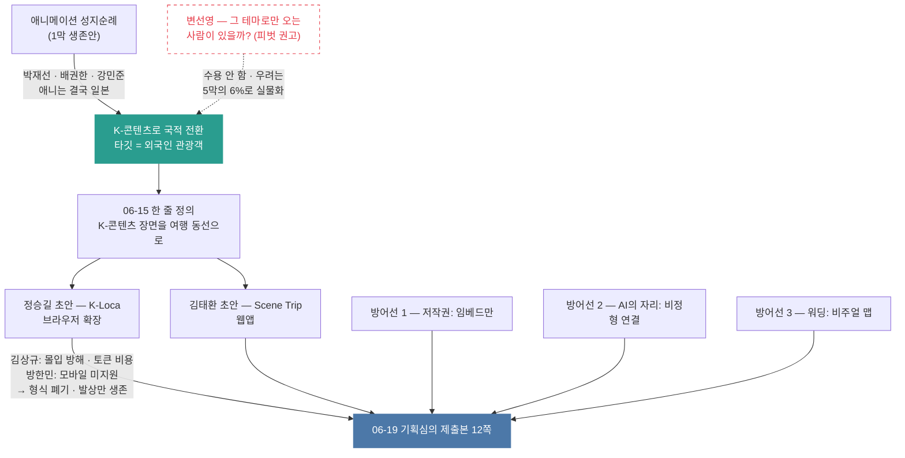

# 2막 · 주제 확정과 기획서 작성

> **기간** 06.11~06.26 · **등장 멘토** 김상규 · 변선영 · 강민준 · 박정두 · 박병선 · 김권섭 · 방한민 · 정문창

## 한눈에



## 국적을 바꾼 한 문장

전환의 논리는 여러 멘토가 거의 같은 말로 반복했다. 박재선(06-07):

> 애니는 거의 일본일 수밖에 없어서… 국뽕으로. 뮤비, 드라마, 영화 → 외국인 대상으로.

팀이 정리한 결론은 이랬다 — "애니메이션 성지순례는 일본 중심으로 흐를 가능성이 커서, 한국 맥락에서는 K-컬쳐 / 국뽕 / 외국인 관광객 / 국내 드라마·영화·뮤직비디오 촬영지로 방향을 트는 것이 더 설득력 있다."

이 전환이 두 가지를 동시에 풀었다. 일본 IP·일본 지리라는 원산지 문제, 그리고 타깃이 **외국인 관광객** 으로 좁혀지면서 페인포인트가 선명해진 것.

→ [[성지순례에서 K-콘텐츠로의 전환]] · [[외국인 타깃 정의]]

06-15 브리핑에서 한 줄 정의가 확정된다 — **"K-콘텐츠 장면을 실제 여행 동선으로 바꿔주는 AI 비주얼 맵/루트 추천 서비스"**.

## 가장 날카로운 반대

같은 시기 변선영(네이버 AI 엔지니어)이 정면으로 의심했다.

> K-콘텐츠 기반으로 여행할 사람이 얼마나 될지. 영향을 받아서 오는 건 많지만, 딱 그 테마로만 오는 사람이 있을까? … 지도를 서비스로 할 정도로 콘텐츠가 풍부한가 — 이거에 대한 의문이 있다.

그의 결론은 피벗 권고였다. 팀은 받아들이지 않고 주제를 유지했다. 다만 이 지적은 사라지지 않았다. 1년 뒤 수집 결과 [[장면 설명이라는 병목]] 이 실질 6%로 드러난 것이 이 우려의 실물이다.

→ [[콘텐츠 다양성 회의론]]

## 세 가지 방어선을 세우다

기획서를 쓰면서 세 가지가 정리됐다.

**저작권** — 모든 멘토가 첫 번째로 지적한 위험이었다. 원칙은 하나로 굳었다. 원본을 저장·재배포하지 않고 공식 채널 임베드로만 연결한다. 사실(위치·작품명)은 저작권 대상이 아니라는 논리와 함께.
→ [[저작권 대응 원칙]]

**AI의 자리** — 방한민이 심사위원 질문을 미리 시뮬레이션했고, 팀이 그 자리에서 답을 만들었다. 좌표·주소는 지도 API가 준다. 작품–장면–장소의 연결은 비정형 텍스트에만 있고 그게 AI 몫이다. 방한민의 평가: "다른 멘티팀들 중에는 AI가 만병통치약처럼 표시되는 경우가 많다. 우린 이 디파인이 좋다."
→ [[AI가 정말 필요한가에 대한 답]]

**표현** — 박병선이 워딩을 고쳤다. "지도가 1개라 했는데 그건 일반 지도가 아니다. 워딩을 하나 만들면 좋겠다." 그리고 "자동화는 RPA 냄새가 나니 쓰지 말라"고 했다. 그가 준 마무리 문장 — **"콘텐츠 소비를 실제 관광 소비로 바꿔서 관광 산업에 기여하겠다"** — 은 이후 모든 기획서에 남는다.
→ [[비주얼 맵이라는 워딩]]

## 두 개의 기획서가 하나가 되다

06-17 무렵 초안이 두 갈래로 갈라져 있었다.

정승길은 **K-Loca** 를 그렸다. 유튜브 시청 화면 위에 장소·지도·루트 레이어를 얹는 브라우저 확장프로그램이다. 영상 타임라인에 마커를 찍고 우측 패널에 "현재 장면 근처 장소 후보"를 띄우는 목업까지 있었다.

김태환은 **Scene Trip** 을 그렸다. React + FastAPI 웹앱 컨셉이다.

확장프로그램은 두 멘토에게 잘렸다. 김상규는 "시청 몰입도"와 토큰 비용을, 방한민은 모바일 미지원을 들었다. 김상규의 결론이 방향을 정했다 — **"앱 기반이 맞을 것 같다. 위치 기반 서비스! 된다 앱은!!"**

→ [[K-Loca 브라우저 확장 컨셉]]

그런데 발상 자체는 죽지 않았다. 한 달 뒤 정문창은 "타임라인 위에 장소를 잇는" 것을 트리플·구글트립과 "명확히 결이 다른 차별화 포인트"로 평가한다. **형식은 버리고 발상은 남았다.**

같은 자리에서 김상규가 BM 아이디어도 하나 냈다 — 해외에서는 무료, 입국하는 순간 유료. 3일권·1주일권 형태로.
→ [[무료는 해외 유료는 방한 중]]

## 06-19, 12쪽을 냈다

두 초안이 합쳐져 제출본이 됐다. 태환 초안의 팀 구성표에 정승길 역할이 "Chrome Extension UI"로 적혀 있는 것이 병합 중이던 흔적이다.

프로젝트명은 「(SceneTrip) K-콘텐츠 속 '그 장면, 그 장소'를 실제 촬영지와 맞춤형 여행 코스로 연결하는 외국인 대상 팬덤 여행 앱」. 길다.

→ [[기획심의 제출본 SceneTrip]] · [[유사 서비스 비교와 포지셔닝]]

06-26 엑스퍼트 미팅에서 심사 준비 조언을 받았다. "글보다 그림, 그래프", "BM에 대해 많이 물어보실 것 같다", "유사 서비스를 많이 조사하는 것 추천".

마지막 조언이 정확했다.


## 이 막의 위키 노트

```dataview
TABLE WITHOUT ID file.link AS "노트", date AS "날짜", type AS "종류", adopted AS "반영"
FROM "02_Wiki"
WHERE act = 2
SORT date ASC
```

---
← [[1막 — 주제를 정하기까지]] · → [[3막 — 발표, 피벗 권고, 소프트 피벗]]
