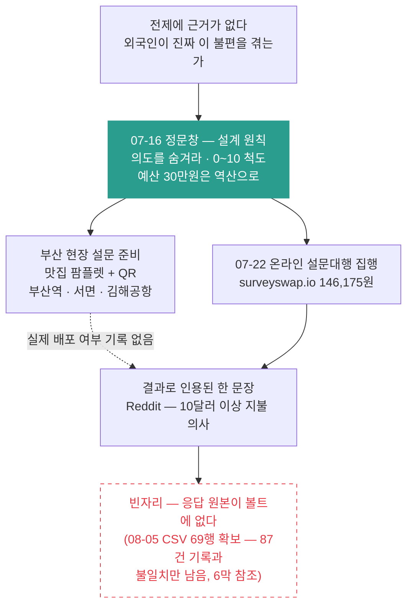

# 4막 · 페인포인트 검증과 설문조사

> **기간** 07.16~07.25 · **등장 멘토** 정문창 · 김상규
>
> [!note] 5막과 시간이 겹친다
> 이 시기 팀 위키·Jira 세팅(7/18)과 박재범 멘토링(7/21)이 나란히 진행됐다. 그쪽은 [[5막 — 로드맵과 첫 스프린트]] 가 다룬다. **막을 날짜가 아니라 주제로 갈랐다.**

## 한눈에



## 왜 설문이었나

피벗 논의 내내 같은 말이 반복됐다. 차별화도 BM도 결국 **"외국인이 진짜 이 불편을 겪는가"** 라는 전제 위에 서 있는데, 그 전제에 근거가 없었다.

심사위원(지적 5번): "실제 K-콘텐츠에 관심 있는 외국인 관광객에 대한 조사 필요. 레딧 같은 데에 K-drama 태그 걸어서 설문조사 해볼 것."

사무국 평가의견: "기획 심의 이후 진행될 현장 설문조사를 통해 외국인들이 실제 체감하는 정보 단절 및 이동의 불편함을 데이터로 더 구체화하여 기획의 완성도를 보완할 필요가 있음."

김상규(07-04): "다음 한 주 동안 **다섯 명이라도 인터뷰** 해보는 게 결정적."

## 설문을 잘못 짜는 법부터 배웠다

정문창이 07-16에 원칙을 줬다. 요지는 **의도를 숨기라** 는 것이다.

> 우리의 의도가 너무 잘 보여도 품질이 떨어진다.

김태환이 받아적은 문장이 더 분명하다 — "우리들의 설문조사 의도를 넣을수록 설문의 질은 떨어진다."

김상규도 같은 함정을 짚었다. LLM으로 설문을 짜면 **"있으면 쓸 것 같아요~"라는 답만 잔뜩 나온다** 는 것.

그래서 문항 형태를 바꿨다. yes/no가 아니라 **0–10 흥미도 척도** 로. "관심 있어요/없어요가 아니라 어느 정도까지의 관심?"

예산 상한도 정해졌다 — **30만원 이내**. 그런데 이 숫자도 감이 아니라 계산에서 나와야 한다는 게 정문창의 요구였다.

> 한 명에게 얼마나 받을 수 있길래… 역산. 1인 모객비용으로 얼마 들까? 5만원. 얼마를 태워야 될까? 태울 가치가 있을까?

→ [[설문 설계 원칙]] · [[모객비용 역산]]

## 부산역으로 나가려 했다

07-07~07-08 회의에서 현장 설문을 설계했다. 김상규의 아이디어를 따랐다 — 맛집 팜플렛을 미끼로 쓰고 QR로 구글폼을 연결하는 방식.

A4에는 핵심 페인포인트 문항만, 언어별(영어·일본어·중국어)로. 팜플렛에는 맛집 정보와 QR. 배포처는 부산역·서면역·김해공항. 동구청 관광 홈페이지를 통하면 수수료 5,000원에 가능하다는 것까지 알아봤다.

맛집 목록도 뽑았다. 씨앗호떡(남포동), 밀면·돼지국밥(서면), 낙곱새, 꼼장어. 인당 40장.

→ [[부산 현장 설문 준비]]

## 실제로 집행된 것

2026-07-22, **surveyswap.io에 146,175원**. 활동비 관리 문서에 한 줄로 남아 있다. 정문창이 제시한 30만원 상한의 절반이다. 김태환의 07-21 기록에 "설문조사 결제받으려다가 실패함"이 있는 걸 보면 하루 늦게 처리된 것으로 보인다.

→ [[설문대행 이용]]

## 결과로 인용된 한 문장

김상규가 피봇팅 멘토 의견서(07-13)에 쓴 문장이 이 시기 유일한 정량 근거다.

> Redit 외국인들 대상으로 빠르게 설문조사를 진행하였고, 국내 여행 시 많은 불편함을 느끼고 있고, 기획안 서비스가 출시될 경우 **10달러 이상 지불할 의사가 있다** 고 확인하였습니다.

이 문장이 "피봇팅해야 할 명백한 사유가 없다"는 그의 결론을 받친다.

→ [[Reddit 설문과 10달러 지불 의사]]

> [!important] 여기가 이 막의 빈자리다
> **응답 원본이 볼트에 없다.** 표본 크기도, 문항 문구도, 응답 분포도 확인할 수 없다. 그래서 이 수치는 인용 이상으로 쓸 수 없다.
>
> 아이러니가 있다. 정문창과 김상규 본인이 **"있으면 쓸 것 같아요라고 대부분 답한다"** 고 경고한 그 함정에 이 문항이 걸리지 않았는지 확인할 방법이 지금은 없다.
>
> 정문창이 피봇팅 의견서 보완 1번으로 요구한 것도 정확히 이 지점이다 — "패스·단품 가격과 **구매 전환율(%) 목표를 숫자로** 제시하고 부산 현지 관광객 설문으로 조기 실측할 것."
>
> ~~데이터가 확보되면 `02_Wiki/설문조사 결과.md` 로 만들고 이 자리에 링크한다.~~
>
> **(2026-08-05 후속)** 응답 원본 CSV가 볼트에 들어왔다 — `01_Raw/정권호/K-Content Travel — 90-Second Fan Survey (Anonymous).csv`, 69행 × 27열. 응답의 88%가 7/22 설문대행 집행 이후 나흘에 몰려 있어 그 캠페인의 응답으로 보인다. 정리는 [[설문조사 결과]] 참조. 다만 두 가지가 남았다: MZ2AZ-90 기록의 "7/27 기준 응답 87개"와 CSV 69행이 어긋나고, 위 10달러 문장의 출처가 이 설문인지도 확인되지 않았다(김상규 의견서는 07-13 — CSV 첫 응답 07-08보다는 뒤이나 대행 집행 07-22보다 앞이다). **빈자리가 절반만 닫힌 셈이다.**

## 검증이 기획을 바꾼 지점

설문과 별개로, 이 시기 정문창이 던진 조언 몇 개가 5막의 설계에 들어간다.

- **챗봇이 없으면 BM이 샌다** — "챗봇 기능이 들어가지 않으면 경로 유출 가능성이 있어 서비스의 가치가 떨어질 가능성이 높다. 루트를 파는 것에서 끝나는 것이 아니라 다른 차별점을 두는 것이 좋아 보인다."
- **루트를 스토리로** — "디트로이트 비컴 휴먼처럼 트리 형태로. 출연진이 여러 명이면 그 사람 뒤 따라가는 개념으로 다른 공간으로."
- **첫 단계에서 네비게이션은 넣지 마라** — "특히 도보 이동의 네비게이션은 힘들다."


## 이 막의 위키 노트

```dataview
TABLE WITHOUT ID file.link AS "노트", date AS "날짜", type AS "종류", adopted AS "반영"
FROM "02_Wiki"
WHERE act = 4
SORT date ASC
```

---
← [[3막 — 발표, 피벗 권고, 소프트 피벗]] · → [[5막 — 로드맵과 첫 스프린트]]
