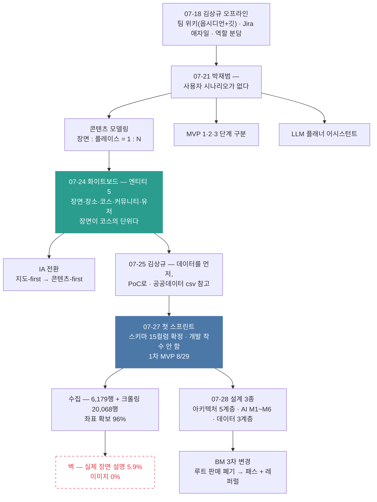

# 5막 · 로드맵과 첫 스프린트

> **기간** 07.18~07.28 · **등장 멘토** 김상규 · 박재범 · 방한민
>
> [!note] 4막과 시간이 겹친다
> 설문(7/16~7/25)이 진행되는 동안 이쪽 일도 나란히 돌았다. **주제로 갈랐다.**

## 한눈에



## 07-18, 일하는 방식을 먼저 세웠다

김상규 오프라인 멘토링에서 세 가지가 한꺼번에 정해졌다.

**팀 위키** — 컨플루언스 대신 옵시디언, 깃으로 관리. "어차피 md 파일이니까." 이미지는 구글 드라이브에 두고 MCP로 연결. 담당은 김태환.

그가 남긴 한 줄이 지금 이 볼트의 파이프라인을 예고했다.

> 01_RAW에 ppt 넣으면 1차로 pdf로 바꾸고 md로 전사하는 걸 넣자.

**Jira와 애자일** — Epic(큰 단위) / Story(1주) / Task(하루). PO만 백로그를 쓴다. 매주 월요일 스프린트 플래닝, 끝나면 리뷰와 회고. 데일리 스탠드업 15분.

여기에 특이한 항목이 붙는다 — **스크럼 마스터와 PO를 AI 스킬로 만든다.** "어제 claude와 대화한 로그를 옵시디언에 남겨두고, 다음 날 스크럼 마스터가 보고 뭐가 됐는지 판단."

**깃허브 전략** — GitHub Flow. 브랜치명과 커밋 메시지에 Jira 티켓 키를 넣는다.

→ [[팀 위키와 Jira 세팅]] · [[애자일 스프린트 운영]]

**역할도 이때 굳었다** — 태환 = 데이터/AI + 위키, 권호 = 인프라/Jira/백엔드, 승길 = 지도/프론트/전체기획.

지도를 한 사람이 맡기로 한 데는 이유가 있었다. 김상규: "지도가 핵심 기능. 지도 하는 것 자체가 프론트/백엔드/AI…? **지도를 누가 개발하느냐에 따라 퀄리티가 많이 달라질 것 같아.**"

→ [[역할 분담 확정]] · [[지도는 누가 만드느냐가 품질을 가른다]]

## 07-21, "시나리오가 없다"

박재범 멘토링. 2시간 24분 온라인. 지적은 한 줄이었다.

> 사용자가 이 서비스를 어떻게 쓰는지에 대한 시나리오가 없다.

목업이 없어서가 아니라 **목업만 있어서** 문제였다. 화면은 그렸는데 그 화면들이 어떤 순서로 어떤 사용자 상태를 만드는지가 비어 있었다.

그는 지적만 하지 않고 그 자리에서 설계를 해 보였다. 콘텐츠 모델링 → 데이터 파이프라인 → 사용자 시나리오 → MVP 1/2/3 로드맵까지. 태블릿 필기가 사진으로 남아 있다(판독률은 낮다).

→ [[박재범 멘토링 — 사용자 시나리오가 없다]]

**세 가지가 여기서 나왔다.**

**① 콘텐츠 모델링** — 코스를 "여행지의 시퀀스한 트라젝토리 한 에피소드"로 정의했다. 엔티티는 `[드라마 장면]` `[Place]` `[코스]`, 앞의 둘 사이는 **1 : N**.
→ [[콘텐츠 모델링 — 장면 플레이스 코스]]

**② MVP 단계** — Data 축과 기능 축을 나눠 3단계로. MVP#1은 드라마 데이터 + My Course, MVP#2는 드라마+POP + 개인화 추천, MVP#3은 **물음표**. MVP1까지는 팀이 직접 데이터를 만들고, 그다음에 크라우드소싱 비용을 건다.
→ [[MVP 1·2·3 단계 구분]]

**③ LLM 플래너** — 사용자가 직접 코스를 짜는 대신 NotebookLM 방식으로 LLM이 대화로 짜준다. "경로 최적화가 자연스럽게 녹아든다."
→ [[LLM 플래너 어시스턴트]]

**실행 지침이 특이했다.** 계획부터 세우지 말고 각자 파트를 먼저 손대서 속도 감을 잡은 뒤, 한 달을 **3일 단위 블록 12개** 로 쪼개라는 것.

회의가 끝나고 팀이 자각한 것은 하나였다 — **"명시화가 안 된 게 너무 많다."** 금요일까지 각자 기술 계획을 짜오고, 금요일에 만나서 확정하기로 했다.

## 07-24, 화이트보드 앞에서

그 금요일이다. 부산센터 18층 회의실 화이트보드에 MVP1 데이터 모델을 그렸다. 사진 두 장이 남아 있다.

엔티티 다섯 — **장면 · 장소 · 코스 · 커뮤니티 · 유저**. 장소 : 장면 = 1 : N. 장소 대표 이미지는 구글 API에서, 작품 포스터는 포스터 API에서.

두 번째 사진에 파란 곡선 화살표가 하나 더 붙어 있다. 장면 설명에서 코스 설명으로 가는 화살표, 라벨은 **`축약 : LLM`**.

그리고 코스 컬럼에 빨간 글씨로 이 프로젝트의 핵심이 적혔다.

> ② 설명(여행계획) ↳ **작품과 관련된 설명** (같은 장소라도 어느 장면 보고 온 건지)

일반 여행앱은 **장소** 가 단위다. 경복궁은 하나의 POI고 누가 왜 가든 같은 설명이 붙는다. 그래서 심사위원이 "다른 여행앱 기능의 한 부분 아닌가"라고 물은 것이다. **장면을 단위로 잡으면** 같은 경복궁이라도 케데헌 2화를 보고 온 사람과 눈물의 여왕을 보고 온 사람에게 다른 설명, 다른 동선이 붙는다.

→ [[MVP1 데이터 모델 (7·24 화이트보드)]] · [[장면이 코스의 단위다]]

**같은 날 IA가 뒤집혔다.** 기존 목업은 지도-first(첫 화면 = 지도 + 핀)였는데, 박재범의 지적은 **"지도만 뜨면 사용자가 뭘 해야 할지 모른다"** 였다.

`카테고리(드라마) → 작품 목록 → 장면 리스트 → 장면 상세(담기) → 마이코스 편집`

지도가 "핵심 기능"에서 "콘텐츠 탐색의 결과를 보여주는 뷰"로 위상이 바뀐 순간이다.

→ [[IA 전환 — 지도-first에서 콘텐츠-first로]]

이 모든 결정을 한 문장이 지탱한다. 7/25에 갱신된 프로젝트 컨텍스트 문서에 적힌 것 —

> **외국인은 한국 지리는 몰라도 콘텐츠는 안다** → 콘텐츠(장면)가 내비게이션 역할을 한다.

→ [[외국인은 지리는 몰라도 콘텐츠는 안다]]

## 07-25, "데이터를 먼저 쌓아보라"

김상규 멘토링. 로드맵을 거창하게 짜지 말라는 말이 핵심이었다.

> 너무 로드맵 거창하게 하지 말고 데이터를 먼저 쌓아보고. 영상에 나온 1화나 2화 정도 촬영지 장소 수집. 아무거나 하나 선택해서. **1회 해봤을 때 나온 산출물을 우선 보고 시간·비용 어떻게 되는지 비교 평가.**
> 너무 한 번에 다 모을 생각보다 조금이라도 **PoC 개념으로.**

그가 `data.go.kr` 에서 **한국문화정보원 미디어콘텐츠 영상 촬영지 데이터** 를 짚어줬다. "별로 가져올 건 없어 보이지만 **csv 형식은 따라 해도 괜찮아 보임.**"

이 조언이 그대로 실행된다. 그 공공데이터가 지금 볼트에 들어와 있고, 자체 수집 스키마도 비슷한 형태다.

→ [[데이터 확보 전략]]

## 07-27, 첫 스프린트

목표를 딱 둘로 못 박았다. ① 데이터 스키마 확정·수집 ② 검색·지도 탭 목업. **개발은 이번 주에 착수하지 않는다.**

회의 내내 반복된 지적이 "너무 다 하려고 한다"였다.

스키마가 확정됐다 — 15컬럼, 컬럼명은 영문 통일. 의도적으로 뺀 것이 둘 있다. **전화번호**(외국인이 전화할 일 없음)와 **영업시간**("책임져야 할 범위가 너무 넓어짐"). 06-19 기획서에 있던 "실시간 개방 여부, 운영시간 조회"가 이때 삭제되고 외부 링크로 대체됐다.

→ [[촬영지 수집 스키마 15컬럼]] · [[1차 스프린트 — 데이터 스키마 확정]]

> [!note] 뒤늦게 들어온 기록 (2026-08-05 추가)
> 정권호가 적은 1주차 스프린트 플래닝 기록이 6막 증분 전사로 볼트에 들어왔다. 이 회의에서 함께 정해진 것들이 더 있다 — 로그인은 자체 가입 없이 소셜 로그인(OAuth)만, 다국어는 한/영/일 기본에 중국은 번체(대만)만 검토, 음식점·카페는 작품 경로당 2~3곳 수작업 큐레이션. 원문은 `전사/정권호/(1주차)2026년 7월 27일 Sprint Planning.md`.

일정도 확정됐다. 1차 MVP **8/29**, 중간발표 9/18~19. 목표일이 8/22에서 한 주 밀린 건 8/17~21 AWS 교육 주간 때문이다.

→ [[일정 계획과 1차 MVP 목표일]]

## 그리고 벽에 부딪혔다

수집이 시작됐다. 정권호가 네 차례에 걸쳐 6,179행 / 185개 타이틀을 모았다. 출처 URL 접속 검증 241/241 통과. kdramamap 크롤링분은 20,068행. 좌표 확보율 96%.

숫자만 보면 순조롭다. 그런데 정권호가 자기 문서에 경고를 달아 두었다.

> 1~3차 363행은 출처를 하나씩 확인하며 만든 큐레이션 데이터로 **실제 장면 설명이 들어 있다.** 4차 5,816행은 장소·주소·좌표만 있고 **장면 설명이 없다.**
> **실제 장면 설명 보유 행은 363행(전체의 5.9%)뿐이다.**

`scene_description` 채움률이 형식상 100%인 것은 착시다. 5,816행에는 `촬영지로 확인됨 — 구체적인 장면 정보 미확인 (KDramaMap 일괄 수집분)` 이라는 고정 문구가 들어 있다.

**이것이 이 프로젝트의 현재 위치다.** 좌표는 풀렸고 장면 설명이 안 풀렸다. 그런데 [[장면이 코스의 단위다]] 가 이 서비스의 차별화 논리다. 장면 설명이 없으면 장소만 남고, 장소만 남으면 일반 여행앱과 같아진다 — 정확히 사무국이 지적하고 변선영이 2막에서 의심했던 그 지점이다.

`place_image_url` 은 채움률 0%다.

→ [[장면 설명이라는 병목]]

대조군이 하나 있다. 김상규가 짚어준 한국문화정보원 공공데이터(15,034행)는 장면 설명이 제대로 차 있다 — "6회에서 김은희(한예리)와 안효석(이종원)이 윤태형(김태호)의 은신처에서 서울로 돌아갈 때 이 카페에 들린다." 다만 **2022년 11월 기준이라 신작이 없다.**

## 07-28, 설계 문서가 쏟아졌다

같은 날 세 개의 문서가 만들어졌다.

**아키텍처 연결도** — Frontend → Backend → AI Service → Data → External 5계층. "Frontend는 보여주고, Backend는 지키고, AI Service는 생각한다." 데이터 흐름 3종이 명시돼 있고, 그중 배치 파이프라인에 **HITL 사람 검수** 단계가 들어 있다.
→ [[아키텍처 5계층 구조]]

**AI 구현 도식** — 목업 화면 하나하나에 번호를 달고 뒤에서 돌 AI 모듈을 매핑했다. M1 수집·추출 / M2 RAG·검색 / M3 실시간 Agent / M4 추천 / M5 경로 생성 / M6 다국어 / 권한.
→ [[AI 구현 범위 M1~M6]]

그중 가장 영리한 설계가 **권한 기반 차등 RAG** 다. 유료화를 기능 잠금이 아니라 **AI가 볼 수 있는 데이터 범위** 로 구현한다. 같은 질문이라도 무료 유저는 요약형 답변, 패스 유저는 상세 씬까지 — 차이는 RAG 검색 범위에서 갈린다.
→ [[권한 기반 차등 RAG]]

**데이터 전략** — 7/24에 "맵 API는 평점·리뷰를 제공하지 않는다"고 막혔던 문제가 풀렸다.

> **"제공이 안 된다"가 아니라 "저장이 안 된다"이다.** 이 둘은 완전히 다르고, 구분하는 순간 설계가 풀린다.

리뷰·사진·평점은 저장이 금지될 뿐 **라이브 호출 + 어트리뷰션 표시로 화면에 띄우는 건 허용** 된다. 여기서 데이터 3계층(우리 자산 / 라이브 호출 / 외부 링크)이 나왔다.
→ [[Google Places 저장 금지와 표시 허용]] · [[데이터 3계층 전략]]

## 그리고 BM이 또 바뀌었다

07-28, 팀 결정으로 **루트 유료 판매(마켓)를 폐기** 했다. 목업까지 만들어 둔 기능이다($1.50~$2.99 건당구매, 3-Day Pass $14.99).

계기는 김상규의 07-25 지적으로 보인다.

> 루트/경로 구매는 이용자에게는 의미가 없게 느껴질 가능성이 높다 → 아예 서비스의 유료화로 생각해보라.

대신 **가이드 투어·여행 상품·로컬 제휴 레퍼럴** 구조로 갔다. BM이 세 번째로 바뀐 셈이다 — 단기 구독 → 무료·패스·루트 단품 → 패스 + 레퍼럴.

→ [[경로마켓에서 레퍼럴로]]

같은 스프린트에서 **루트 자동 생성도 초기 수작업 큐레이션으로 내려왔다.** 06-19 기획서의 「AI 기반 여행 일정 자동 생성」이 "일단 사람이 만든다"가 된 것이다.

→ [[MVP 범위 축소]]

## 지금 (2026-07-29)

- 전사·위키·Story 파이프라인이 이 볼트에 구축됐다 — 7/18 김상규가 말한 그것
- 1차 MVP까지 한 달, AWS 교육 주간 한 주를 빼면 실질 3주
- **장면 설명 6%** 와 **이미지 0%** 가 미해결
- 설문 응답 원본이 볼트에 없다
- 챗봇을 둘러싼 멘토 셋의 판단이 갈린 채다 (박재범 = 핵심 차별화 / 정문창 = 없으면 BM이 샌다 / 김상규 = 대중화 안 된 기능이라 위험)
- 팀의 공통 정량 목표는 1막에서 요구받은 뒤로 아직 문서에 없다


## 이 막의 위키 노트

```dataview
TABLE WITHOUT ID file.link AS "노트", date AS "날짜", type AS "종류", adopted AS "반영"
FROM "02_Wiki"
WHERE act = 5
SORT date ASC
```

---
← [[4막 — 페인포인트 검증과 설문조사]] · → [[6막 — 데이터 완성과 개발 착수]]
