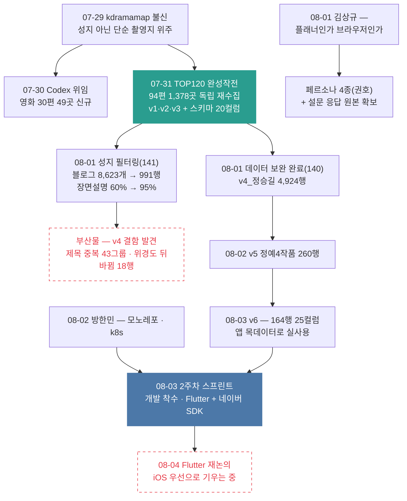

# 6막 · 데이터 완성과 개발 착수

> **기간** 07.29~08.04 · **등장 멘토** 김상규 · 방한민
>
> [!note] 5막의 벽에서 이어진다
> 5막은 "좌표는 풀렸고 장면 설명이 안 풀렸다"(실제 장면 설명 5.9%)에서 끝났다. 6막은 그 벽을 데이터로 뚫는 일주일이고, 마지막 이틀에 개발이 시작된다.

## 한눈에



## 07-29, 숫자를 의심했다

5막 끝의 수집 데이터는 양으로는 충분해 보였다 — 크롤링 20,068행. 그런데 김태환이 이날 기록에 남긴 진단은 반대였다. **kdramamap은 성지가 아니라 단순 촬영지 위주라 부실하다.** 도깨비의 주문진 방파제 — 누구나 아는 성지 — 가 거기 없었다. 덤으로 한국문화정보원 공공데이터가 다른 유료 사이트(KPopDramaSpots)에 그대로 재사용된 것도 확인했다("내 4,400원").

그래서 방향이 바뀐다. 전량을 다 살리는 게 아니라 **외국인이 실제로 아는 작품부터 골라내는 것.** 김태환은 위키 언어판 수 40점 + 위키 PageViews 40점 + 데이터 충실도 20점으로 100점 점수식을 만들어 476편 중 상위 100편을 뽑았다(위키데이터 매칭 91%). 그런데 이 상위 100편 5,740곳에서 실제 장면 설명이 있는 행은 **60곳, 1.0%** — 벽은 여전했다.

→ [[외국인 인기도 점수식]]

## 07-30, Codex에게 일감을 넘겼다

정승길은 사람(과 Claude)의 손이 모자라자 **Codex CLI에 리서치를 위임** 했다. 규칙이 먼저였다 — Codex는 `data/codex/` 밖을 수정할 수 없고, 작업 시작 시점의 원본 스냅샷을 남긴다. Claude가 드라마를 파는 동안 Codex는 촬영지 0건인 영화 477편을 우선순위로 조사해 **30편 49곳을 새로 확보** 했다. 병합 후 마스터는 21,106행.

→ [[Codex 위임 리서치]]

## 07-31, 완성작전 — 그리고 스키마가 또 자랐다

이날 밤 로그의 제목이 "TOP120-MVP1-완성작전"이다. kdramamap을 무시하고 **94편 1,378곳을 독립 재수집** 했고, 케이팝 데몬 헌터스(케데헌) 12곳이 처음 등재됐다. 결과물이 세 벌로 정리됐다 — v1 기본(21,844행×20컬럼), v2 확장(+구글맵 URL), v3 MVP1(5,669행).

아침 회의 문서는 두 가지를 팀에 물었다. 하나는 **스키마 확장** — 15컬럼에 famous_rank(글로벌 인기 순위) · recent_rank(최신 12개월) · audience_acc(영화 누적 관객수) · award(수상)가 붙어 20컬럼이 됐다. 다른 하나는 **노출 범위** — 전수는 검색용으로 남기고, 앱 기본 노출은 TOP100+TOP20 합집합 **114편** 으로 줄인다. 인기도 순위가 고착되지 않도록 **반감기(half-life)** 를 적용하자는 결정, 회의록을 Jira 스토리 단위 문서(JiraDocs)로 남기자는 결정도 이날 나왔다.

같은 시기 권호는 DB 설계를 마쳤다 — **테이블 14개 + 구체화 뷰 1개**, 중복 판정 4단계 규칙, 인기도는 초기 외부지표에서 찜 기반으로 넘어가는 2단계 설계.

→ [[촬영지 스키마 20컬럼 확장]] · [[SceneTrip DB 스키마 14테이블]] · [[외부 데이터 소스 검토]]

## 08-01, 벽이 뚫린 날

두 사람이 각자 다른 방법으로 같은 벽을 쳤다.

**정승길 — 채우기 (MZ2AZ-140).** LLM 배치로 장면 설명을 정밀 보강하고(파일럿에서 Haiku는 14건 중 0건 합격, Sonnet으로 확정), 네이버 URL을 구제 배치로 채우고, TMDB에서 포스터를 받았다. 결과: 장면 설명 68% · 네이버 URL 82% · 포스터 100% · 감독명 100%. 둘 다 빈 745행은 버렸다. **v4_정승길 4,924행 확정.**

**김태환 — 걸러내기 (MZ2AZ-141).** "실제 성지는 블로그 여러 글에 반복 등장한다"는 가설로 네이버 블로그 8,623개를 크롤링해, 유효 언급 수로 S/A/B/C 등급을 매기고 Claude가 근거 문장을 읽어 최종 판정했다. **991행/151편 채택**, 필터 통과분의 장면 설명 채움률은 60%에서 **95%** 로 올랐다. 5막의 5.9%가 여기서 사실상 해소된다 — 전량을 채워서가 아니라, **설명이 있는 진짜 성지만 남겨서.**

부산물이 있었다. 필터링 과정에서 v4 원본의 결함 두 개가 드러났다 — 작품명 표기 흔들림(`눈물의여왕`/`눈물의 여왕`)으로 중복 그룹 43개, **위도·경도가 뒤바뀐 행 18개**(지도 핀이 엉뚱한 곳에 찍힌다). 산출물에서는 자동 교정됐지만 원본은 아직이다.

→ [[촬영지 데이터 보완 — v4 확정]] · [[성지 필터링 — 블로그 언급 근거]] · [[촬영지 데이터 v1~v6 계보]]

> [!question] 141의 기록이 두 벌이다
> 같은 날짜의 JiraDocs판은 "로컬 LLM은 쓰지 않았다"며 규칙만으로 **1,091행/160편** 을 채택했다고 적어, 방법론과 수치가 위 기록과 다르다. 어느 쪽이 최종인지 김태환 확인이 필요하다. 상세는 [[성지 필터링 — 블로그 언급 근거]] 의 확인 필요 항목.

## 같은 날, 김상규가 정체성을 물었다

데이터가 완성되던 바로 그날, 김상규 멘토링은 다른 층위를 쳤다.

> 이 앱은 **AI 여행 플래너** 인가, **지도 기반 촬영지 브라우저** 인가.

이 질문에 팀은 그 자리에서 답하지 못했고, 과제로 남았다. 함께 온 지적이 더 아팠다 — **"현재 개발이 최종 사용자가 아닌 구현자 관점"** 이라는 것. 그는 페르소나를 잡아보라는 말을 두 번 반복했고, MVP에서 즐겨찾기·평점·상세 리뷰를 빼고 경로 안내는 카카오·네이버 연동으로 미루게 했다.

권호의 **페르소나 4종** 문서가 이날 나왔다 — 여행 단계×스타일 2축으로 P1 수집가(27%, 지불 의사 41%) · P2 현장 방랑자(16%, 지도는 100% 필요하다면서 $11 이상 지불은 0명) · P3 위임자(14%) · P4 관망자(25%, 안티 페르소나). 핵심 발견: **완성형 코스를 원하는 10명 중 9명이 방한 경험이 없다.** 문서 스스로는 7/21 박재범의 "시나리오가 없다"에 대한 응답이라고 밝힌다 — 김상규의 요구와는 같은 날일 뿐이다.

그리고 4막의 구멍이 절반 닫혔다. **설문 응답 원본 CSV(69행×27열)가 볼트에 들어온 것이다.** 응답의 88%가 7/22 대행 집행 이후 나흘에 몰려 있다. 다만 MZ2AZ-90 기록의 "응답 87개"와 69행의 차이, "10달러 지불 의사"의 출처는 여전히 미확인이다. 8/3의 기획·BM 진단은 이 데이터로 언어 장벽이 페인포인트 1위(42.2%)임을 확인했고, 동시에 차가운 숫자를 하나 놨다 — 1차 MVP 마감 8/29까지 **실제 개발 가능한 평일은 14일** (AWS 교육 기간 제외). 지금 MVP1 범위는 3명이 14일에 못 끝낸다는 진단과 함께다.

→ [[김상규 멘토링 — 플래너인가 브라우저인가]] · [[사용자 페르소나 4종]] · [[설문조사 결과]] · [[기획·BM 진단]]

## 08-02, 방한민 — 몸부터 만들어라

방한민 멘토링은 기술 체질에 대한 것이었다. **모노레포로 전환하라** — 이유가 시대적이다. "AI한테 시킬 때 여러 레포를 넘나들면 토큰을 너무 먹는다." 폴더마다 다단계 지침(README)을 두면 AI가 스스로 길을 찾는다. 쿠버네티스 개발도 권했고, Terraform(팀 표준)에 맞서 개인적으로는 Pulumi를 선호한다는 소신도 남겼다(Terraform은 제어문이 없어 버그가 단순하게 잡힌다는 논리와 함께).

김태환은 이 흐름에서 인프라 개념 정리 6편을 써 내려갔다 — Docker → 쿠버네티스 → kind(도커 컨테이너로 로컬 클러스터를 띄우는 도구) → Helm → SigNoz(관측성). `kind load` 누락이 가장 흔한 무음 실패라는 것, Apple Silicon(arm64) 빌드가 AWS EKS(amd64)에서 죽는다는 함정까지. 8/4에는 로컬 설치가 표로 완료된다(`just cluster-up` 한 번으로 kind+SigNoz).

같은 날 데이터 쪽에서는 v4의 제목 정규화(204→158개 고유 제목)를 거쳐 **v5 정예4작품(260행×22컬럼)** 이 나왔다 — 도깨비 · 눈물의 여왕 · 이태원 클라쓰 · 케데헌만 남긴, 개발용 정예 데이터다.

→ [[방한민 멘토링 — 모노레포 전환]] · [[로컬 인프라 스택 — kind와 SigNoz]]

## 08-03, 개발이 시작됐다

2주차 스프린트 플래닝. 1주차와 결정적으로 다른 한 줄 — **이번 주부터 실개발에 착수한다.** 데이터는 추가 수집 없이 필터링만.

기술 스택이 확정됐다. Flutter(Dart) + 네이버 지도 SDK, Docker+Compose에서 쿠버네티스로, 이미지는 저장 대신 **S3 링크로 바로 띄우기**, Kafka는 쓰지 않기로. 검색 자동완성은 영어 입력의 단순 단어 매칭부터(RAG는 다음 단계). 역할은 승길 = 프론트(Flutter), 권호 = 백엔드(DB+API+Docker), 태환 = 데이터·AI 조사(자막으로 장면의 분·초를 찾는 subtitle cat 등).

승길은 그날 밤 바로 움직였다. 멘토가 준 모노레포 뼈대로 저장소를 옮기고(방한민 조언의 즉시 실행), **v5를 다시 걸러 v6(164행×25컬럼)** 를 만들었다 — 방송사·연도·장르 3컬럼이 추가된, 지금 Flutter 앱이 물고 있는 목데이터다. Flutter 프로젝트를 생성하고 검색탭 구현까지 갔다. 다음 날 나온 테크 스펙 초안의 첫 줄 원칙이 이 스프린트의 성격을 요약한다 — **"회의 결정이 정본이고, 목업은 참고 자료다."** 그 목업(MZ2AZ-116)은 클릭되는 인터랙티브 프로토타입으로 완성돼 있었고, DB 스키마와 대조한 갭 15항목은 후속 티켓 소재로 넘겼다.

→ [[2주차 스프린트 — 검색탭 개발]] · [[MVP1 프론트 테크 스펙]] · [[작품검색 목업]]

## 08-04, 하루 만의 흔들림

확정한 지 하루 만에 김태환의 기록에 이렇게 적힌다 — **플루터 포기 논의.** Bazel(모노레포 빌드 도구)과의 조합이 번거롭다는 게 이유고, iOS 우선 개발로 의견이 수렴 중이다. 8/3의 "Flutter 확정"과 정면으로 배치되는, 아직 결론 없는 최신 논의다. 스택이 흔들리는 동안에도 인프라 설치와 검색탭 구현은 각자 진행됐다.

## 지금 (2026-08-05)

- 데이터는 **양에서 질로** 완성됐다 — 21,844행(v1)에서 164행(v6)으로, 줄어드는 방향이 완성이었다
- 5막의 벽이었던 장면 설명은 필터 통과분 기준 **95%** — 단, v4 원본의 결함 2건(제목 중복 43그룹 · 위경도 18행)은 원본 미수정
- **"플래너인가 브라우저인가"** 는 여전히 답이 없다 — 김상규가 남긴 과제
- **Flutter 재논의** 미결 — 8/3 확정, 8/4 흔들림, 결론 없음
- MZ2AZ-141 기록 두 벌의 수치 불일치(991 vs 1,091), 설문 87건 vs 69행 불일치, POC 드라마 수(10~20 vs 10~40) — 사람 확인 대기 3건
- 브랜드명 미확정으로 도메인 등록 보류(MZ2AZ-91)
- 1차 MVP 마감(8/29)까지 실제 개발 가능한 평일 **14일** — 권호는 커뮤니티·로그인·마이페이지를 9월로 미루자고 제안했고, 팀 채택 여부는 미확정

## 이 막의 위키 노트

```dataview
TABLE WITHOUT ID file.link AS "노트", date AS "날짜", type AS "종류", adopted AS "반영"
FROM "02_Wiki"
WHERE act = 6
SORT date ASC
```

---
← [[5막 — 로드맵과 첫 스프린트]] · → (진행 중)
